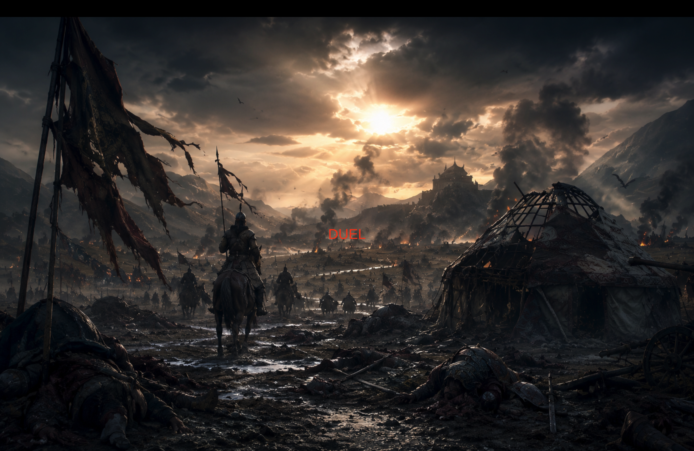
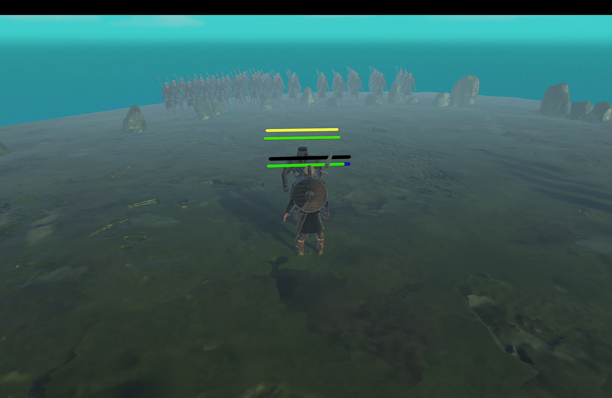
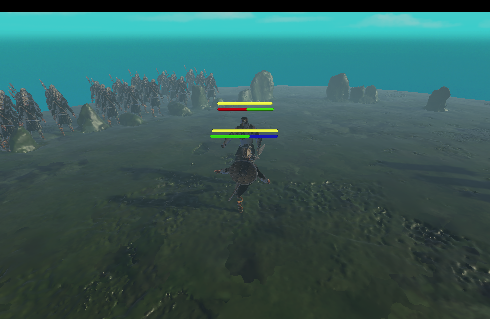
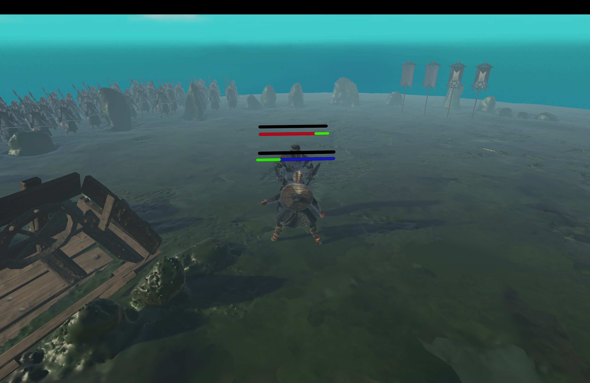
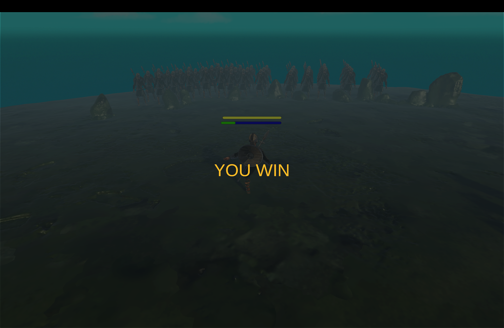

# ⚔️ Turkic Duel

**Turkic Duel** is a 3D one-on-one combat game inspired by ancient Turkic warrior culture.

The game takes place on a battlefield where two armies stand face to face. Instead of a full-scale battle, the fate of the conflict is decided by an honorable duel between two warriors.

---

## 🎮 Overview

In **Turkic Duel**, the player takes the role of **Kultegin**, a brave Turkic warrior who enters the arena to fight against a powerful enemy champion.

The duel happens between two armies, creating a dramatic battlefield atmosphere. The player must use movement, sword attacks, kicks, dash mechanics, and a special spirit ability to defeat the opponent.

This project was created during a **48-hour Game Jam** as a complete playable Unity prototype.

---

## 🕹️ Quick Links

| Resource | Status |
|---|---|
| 📸 Screenshots | Available |
| 🎮 Playable Build | Available |
| 🎥 Gameplay Trailer | Planned |
| 🧾 Release Version | v1.0 |

---

## ✨ Features

- ⚔️ Third-person sword combat
- 🦶 Kick attack system
- 🏃 Dash movement
- 🟡 Spirit system
- 💥 Special ability
- ❤️ Player and enemy health bars
- 🤖 Enemy AI behavior
- 🎵 Battle atmosphere and sound effects
- 🏛️ Ancient Turkic-inspired arena
- 🏆 Win and lose game flow
- 🎬 Intro, main menu, and duel scene flow

---

## 🎮 Controls

| Action | Key |
|---|---|
| Move | WASD |
| Dash | Shift |
| Sword Attack | F |
| Kick | R |
| Special Ability | E |

---

## 🧠 Core Game Systems

### ⚔️ Combat System

The combat system includes sword attacks, kicks, and a powerful special ability. Each attack type has its own purpose during the duel.

The player must control distance, timing, and positioning to defeat the enemy warrior.

### 🤖 Enemy AI

The enemy is controlled by a simple combat AI system. It can move toward the player, attack, retreat, and continue pressure during the fight.

This creates a more dynamic duel experience instead of a static enemy.

### 🟡 Spirit System

The spirit system gives the player access to a stronger special ability. When the spirit energy is ready, the player can activate a powerful strike to change the result of the battle.

### ❤️ Health System

Both the player and the enemy have health bars. The duel ends when one warrior is defeated.

---

## 🛠️ Tech Stack

- **Unity**
- **C#**
- **Universal Render Pipeline**
- **Unity Animator Controller**
- **Mixamo Animations**
- **3D Character Assets**
- **Audio System**
- **Git**
- **GitHub**

---

## 📸 Screenshots

### Main Menu

### Duel Arena

### Combat

### Special Ability

### Win Screen

---

## 🚀 How to Run the Project

1. Clone the repository:

    git clone https://github.com/Zhasu1an-1/zhekpe-zhek.git

2. Open the project in Unity.

3. Open the scene from the `Assets/Scenes` folder.

4. Press **Play** in the Unity Editor.

---

## 📁 Project Structure

    Assets/
    ├── Audio/
    ├── ImportedAssets/
    ├── Materials/
    ├── Scenes/
    ├── SourceFiles/
    ├── EnemyAI.cs
    ├── EnemyHealth.cs
    ├── GameManager.cs
    ├── MainMenuUI.cs
    ├── PlayerAttack.cs
    ├── PlayerHealth.cs
    ├── PlayerMovement.cs
    ├── RandomArenaSounds.cs
    └── WeaponAttach.cs

    Packages/
    ProjectSettings/

---

## 🏛️ Historical Inspiration

The game is inspired by ancient Turkic warriors, battlefield traditions, and the idea of an honorable duel between two champions.

The main character, **Kultegin**, represents the courage, discipline, and warrior spirit of Turkic history.

The goal of the project was not to create a full historical simulation, but to build a short, atmospheric, and playable combat experience inspired by Turkic culture.

---

## 🏁 Game Jam Context

This game was developed during a **48-hour Game Jam**.

The main goal was to build a complete playable prototype with:

- A working combat system
- Enemy AI
- Game flow
- Sound effects
- A playable arena
- A clear win/lose condition

---

## 🔮 Future Improvements

- Add more attack animations
- Improve enemy AI decision-making
- Add cinematic camera effects
- Add more playable characters
- Add more enemy types
- Add more arenas
- Add a downloadable Windows build
- Add gameplay trailer
- Add screenshots and GIF preview
- Improve UI polish

---

## 👨‍💻 Developer

Developed by **Zhasulan**.

This project is part of my game development portfolio and was created to practice Unity, C#, combat systems, AI behavior, and complete game flow development.

---

## 📄 License

This project is currently shared as a portfolio project.
